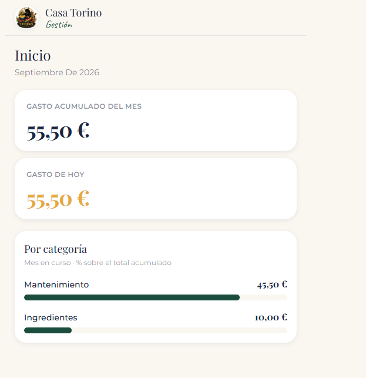
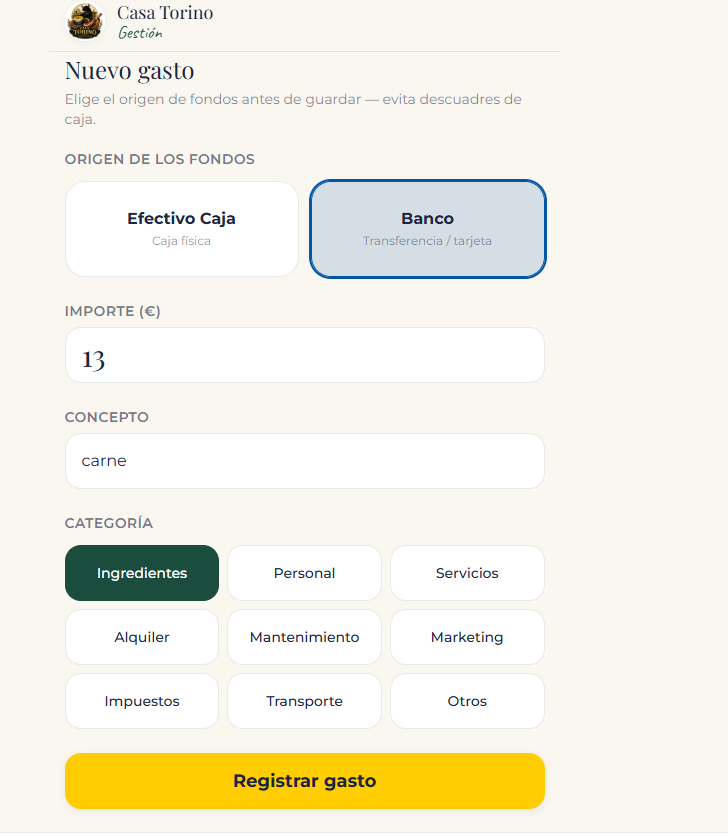
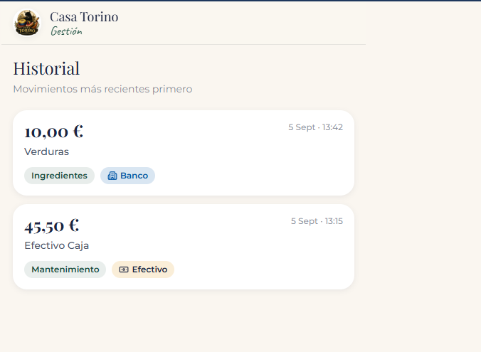

# 🍷 Casa Torino - Financial Back-Office

Aplicación web Fullstack orientada a la gestión financiera interna de un negocio de hostelería. Diseñada bajo un enfoque **Mobile-First** para ser utilizada en pantallas táctiles y dispositivos móviles, operando de forma paralela e independiente al TPV principal del local.

## 🚀 Características Principales

- **Autenticación y Autorización (IAM):** Sistema de login seguro exclusivo para las 4 socias administradoras mediante Supabase Auth.
- **Auditoría y Trazabilidad:** Registro automático de la identidad de la usuaria (`user_id`) en cada transacción mediante Triggers de PostgreSQL.
- **Seguridad a Nivel de Fila (RLS):** Políticas implementadas en la base de datos para garantizar que solo usuarios autenticados puedan leer o escribir información.
- **Dashboard Financiero en Tiempo Real:** Cálculo automático del gasto acumulado mensual y diario, con desglose visual por categorías.
- **Interfaz Táctil Optimizada:** UI construida con Tailwind CSS, evitando tablas complejas y priorizando tarjetas independientes (Cards) de alta legibilidad.

## 🏗️ Arquitectura y Stack Tecnológico

El proyecto está construido utilizando una arquitectura moderna orientada a componentes y servicios Serverless:

- **Frontend:** [Next.js (App Router)](https://nextjs.org/) y React.
- **Estilos:** [Tailwind CSS](https://tailwindcss.com/) con identidad visual corporativa personalizada (fuentes: Montserrat, Playfair Display).
- **Backend & Base de Datos:** [Supabase](https://supabase.com/) (PostgreSQL relacional).
- **Infraestructura CI/CD:** Despliegue automatizado en [Vercel](https://vercel.com/) conectado directamente a la rama `main` de GitHub.

## ## 📸 Pantallas de la Aplicación

- `Login`: Interfaz de acceso seguro. 
- `Dashboard (Inicio)`: KPIs de gastos en tiempo real y barras de progreso por categoría. 
- * `Nuevo Gasto`: Formulario optimizado para entrada rápida de datos. 
- `Historial`: Timeline de movimientos financieros ordenados cronológicamente. ](./docs/Captura3.png)
- `Login`: Interfaz de acceso seguro.
- `Dashboard (Inicio)`: KPIs de gastos en tiempo real y barras de progreso por categoría.
- `Nuevo Gasto`: Formulario optimizado para entrada rápida de datos.
- `Historial`: Timeline de movimientos financieros ordenados cronológicamente.

