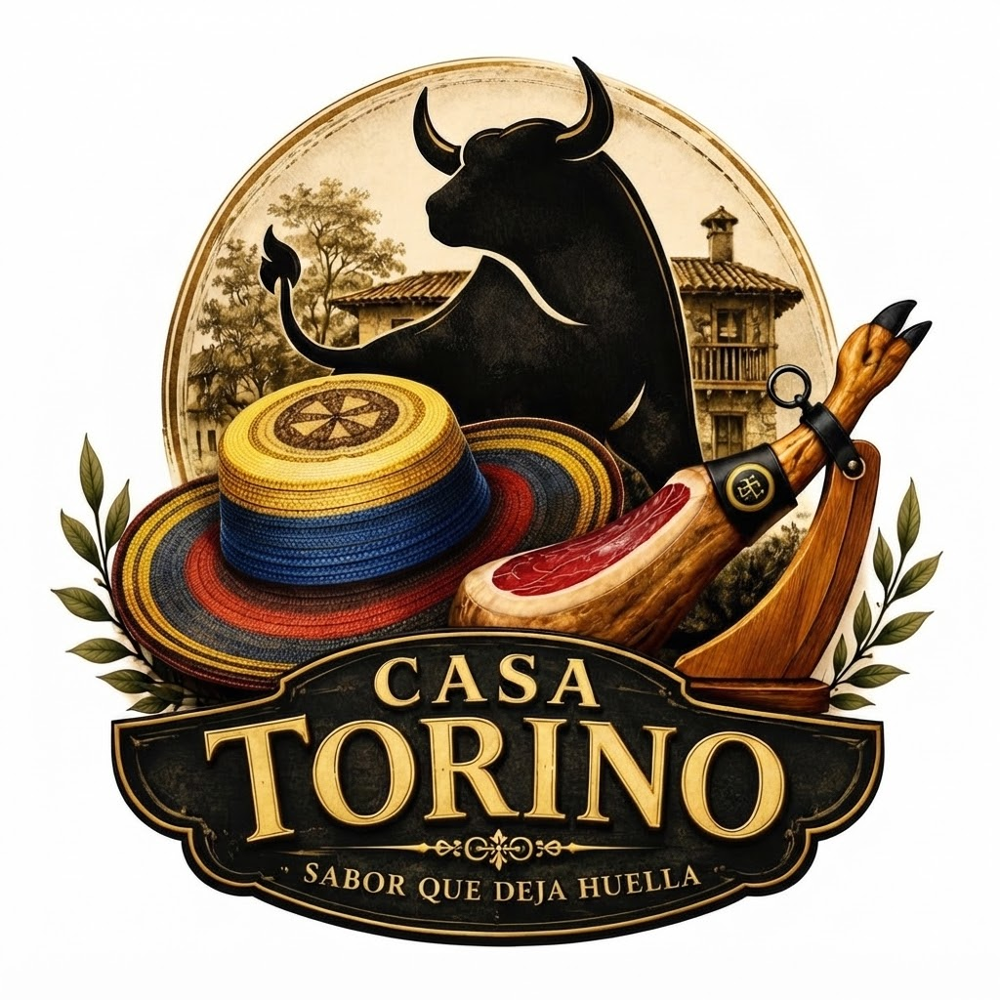

# Casa Torino App — Ecosistema gastronómico

Sistema integral para restaurante (web + TPV + cocina + reservas + ERP), en producción en **Casa Torino · Gijón**.

Sin cuotas mensuales de TPV comercial · sync en tiempo real · PIN en zonas internas · stack Hobby (Vercel + Supabase).

**Estrés real:** +2.600 € y +130 comensales concurrentes en un fin de semana de terraza, sin caídas.

<p align="center">
  
</p>

| Módulo | Producción |
|--------|------------|
| **Web + TPV + Cocina + Fichaje** | [casa-torino-web.vercel.app](https://casa-torino-web.vercel.app) |
| **Reservas staff** | [reservas-casatorino.vercel.app](https://reservas-casatorino.vercel.app) |
| **ERP oficina** | [casa-torino-app.vercel.app](https://casa-torino-app.vercel.app) |


---

## Demostración en Vivo

Grabaciones reales del local (Casa Torino · Gijón): TPV en sala / físico y cocina (KDS).

### TPV

<video src="./docs/media/Tpv/TPV%20Fisico.MP4" controls width="720" playsinline>
  Tu navegador no reproduce vídeo. <a href="./docs/media/Tpv/TPV%20Fisico.MP4">Ver TPV físico</a>
</video>

<video src="./docs/media/Tpv/tpv%20camarera.mov" controls width="720" playsinline>
  Tu navegador no reproduce vídeo. <a href="./docs/media/Tpv/tpv%20camarera.mov">Ver TPV camarera</a>
</video>


- [TPV físico (MP4)](./docs/media/Tpv/TPV%20Fisico.MP4)
- [TPV camarera (MOV)](./docs/media/Tpv/tpv%20camarera.mov)
- [Editar carta (GIF)](./docs/media/Tpv/Editar%20Carta.gif)

### Cocina (KDS)

<video src="./docs/media/KDS/cocina.mov" controls width="720" playsinline>
  Tu navegador no reproduce vídeo. <a href="./docs/media/KDS/cocina.mov">Ver cocina KDS</a>
</video>


- [Cocina KDS (MOV)](./docs/media/KDS/cocina.mov)
- [KDS (GIF)](./docs/media/KDS/kds.gif)

### ERP


Más detalle: [`web/README.md`](./web/README.md) (TPV + KDS) · [`erp/README.md`](./erp/README.md).


---

## Arquitectura (monorepo)

```text
Cliente → Web pública
            └─ Gestión interna (PIN)
                 ├─ TPV (mesas, cobro, carta, fichaje)
                 ├─ Cocina KDS
                 ├─ Reservas staff
                 └─ ERP (caja, fiscal, RRHH, docs)
```

| Carpeta | Qué es |
|---------|--------|
| `/web` | Web clara, interno, TPV, cocina (KDS), fichaje / horas |
| `/reservas` | Agenda del personal (React + Vite + Edge Config) |
| `/erp` | Back-office Next.js 15 + Supabase (P&L, fiscal, RRHH, documentos) |
| `/docs` | Comercial + técnico + media |

---

## Qué incluye

- **TPV** por mesa (móvil + PC sync), envío a cocina, cobro parcial, ticket QZ Tray / POS-58  
- **KDS** solo comida, menús a 1 o 2 tiempos, histórico del día  
- **Carta única** web ↔ TPV (Supabase `ops_kv`) · edición desde TPV  
- **Reservas** + alerta amarilla en TPV  
- **Fichaje** entrada/salida (registro jornada) + horas trabajadas  
- **ERP**: caja TPV, gastos/ingresos, fiscal, RRHH, proveedores, documentos  
- **Respaldo diario** GitHub Actions ~03:00 Madrid (`backup/daily-YYYY-MM-DD`, retención 14 días)

---

## Retos resueltos en producción

1. **Enrutamiento KDS** — postres/bebidas no saturan cocina.  
2. **Menús mixtos** — español 2 tiempos vs colombiano 1 tiempo.  
3. **Hardware local desde la nube** — QZ Tray → ticket / cajón.  
4. **UX móvil** — scroll nativo en camareros; paneles en ≥1024px.  
5. **Secretos fuera del repo** — PIN y tokens solo en Vercel.

---

## Stack

| Capa | Tecnología |
|------|------------|
| Web / TPV / KDS | HTML/JS + APIs Vercel |
| Reservas | React, Vite, Edge Config |
| ERP | Next.js 15, Tailwind, Supabase |
| Datos ops | Supabase `ops_kv` / `time_logs` |
| Hosting | Vercel Hobby |

Docs: [`docs/COMERCIAL.md`](docs/COMERCIAL.md) · [`docs/TECNICO.md`](docs/TECNICO.md) (seguridad, deploy, backup).

---

## Deploy (staff)

```bash
cd web
bash scripts/assert-light-theme.sh
bash scripts/deploy-web.sh
```

Detalle: [`docs/TECNICO.md`](docs/TECNICO.md). Nunca subir `.env`, PINs reales ni tokens a GitHub.

---

<p align="center">
  
  &nbsp;&nbsp;
  
</p>

<p align="center"><sub>Casa Torino · Ceares, Gijón · Sabor que deja huella</sub></p>
