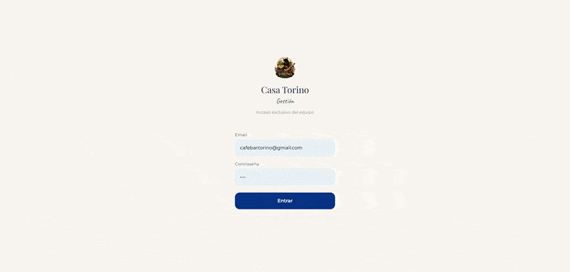
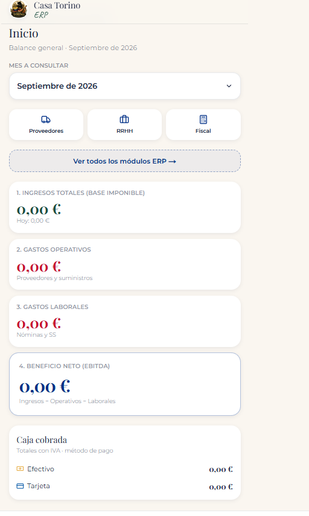
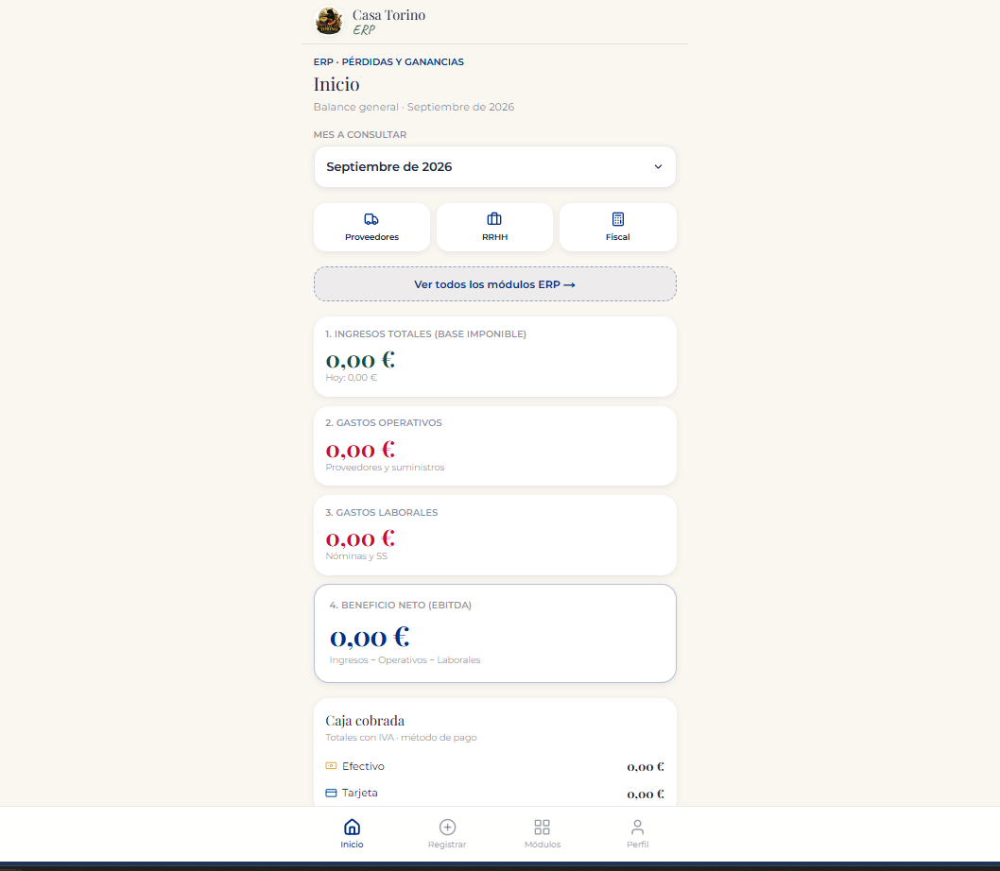
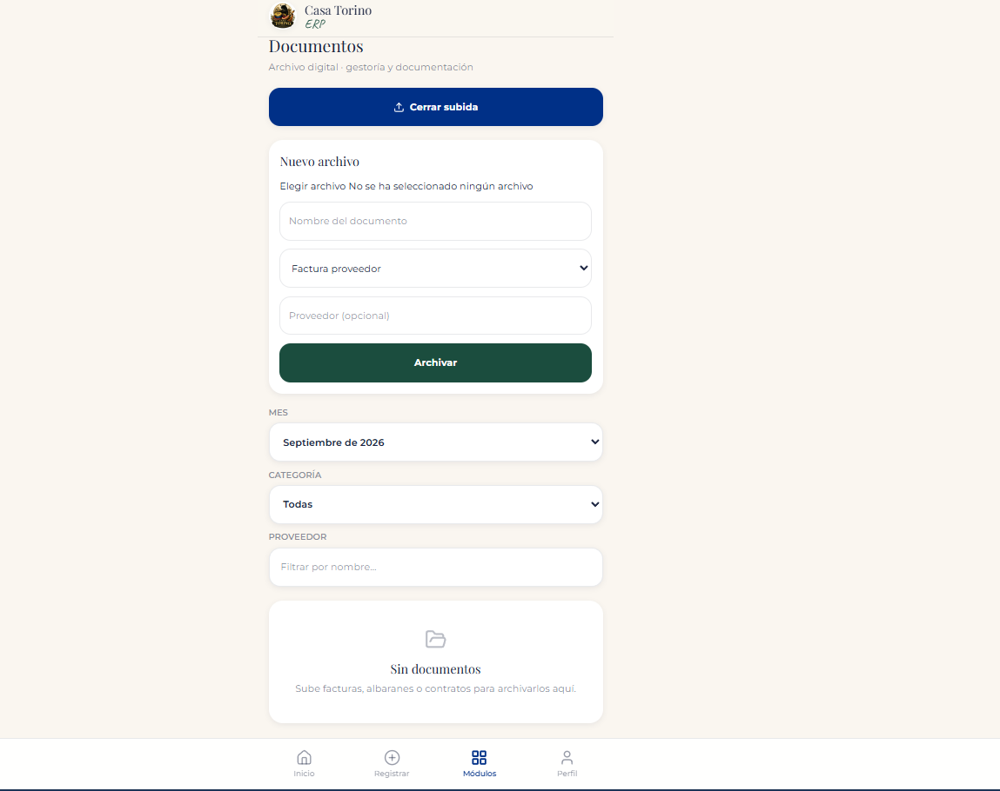
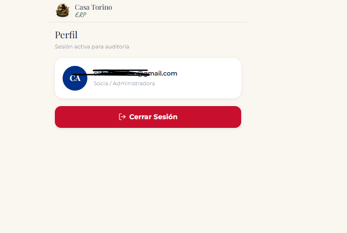

# ERP — Casa Torino (Hospitality Back-Office)

Módulo **ERP / oficina** del monorepo [CasaTorinoApp](https://github.com/Sebastian-Tamayo/CasaTorinoApp) (web + TPV + reservas + ERP).


Back-office fullstack para la gestión **operativa, fiscal, laboral y documental** de un negocio de hostelería. **Mobile-first**, pensado para usarse en el propio local.

**Producción:** https://casa-torino-app.vercel.app  
**Proyecto Vercel:** `casa-torino-app` · Root Directory = `erp`

---

## Por qué es un ERP de hostelería

No es solo un contador de gastos: centraliza el control del bar-restaurante:

1. **Documentos** — facturas, albaranes y contratos en Supabase Storage  
2. **RRHH** — plantilla, nóminas, SS e IRPF  
3. **Fiscalidad** — IVA soportado/repercutido y trimestres  
4. **Proveedores** — ranking de compras  
5. **P&L / EBITDA** — resultado operativo en tiempo real  
6. **Caja** — ingresos (local/domicilio, tarjeta/efectivo) y enlace con cierres TPV  

---

## Demostración




---

## Módulos

* **Balance (P&L / EBITDA)** — ingresos − mercancía − laboral; cierres mensuales  
* **Gestión documental** — PDF/imagen, visor, filtros, bucket `documentos_adjuntos`  
* **RRHH** — fichas, liquidar mes, histórico de nóminas  
* **Fiscal trimestral** — IVA e IRPF acumulado  
* **Proveedores** — volumen por distribuidor  
* **Caja** — ingresos/gastos con confirmación y RLS  

---

## Stack

| Capa | Tecnología |
|------|------------|
| Frontend | Next.js 15 (App Router) + React |
| Estilos | Tailwind CSS (móvil / táctil) |
| Datos | Supabase (PostgreSQL + Storage + RLS) |
| Deploy | Vercel ← GitHub `main` (carpeta `erp/`) |

---

## Modelo de datos (resumen)

Tablas protegidas con **RLS**: `gastos`, `ingresos`, `empleados`, `nominas_pagadas`, `documentos` + storage `documentos_adjuntos`.  
Migraciones en `erp/supabase/migrations/`.

---

## Pantallas

| Inicio / balance | P&L |
|:---:|:---:|
|  |  |

| Documentos | Perfil |
|:---:|:---:|
|  |  |

---

## Estructura

```text
erp/
├── src/                 # App Router, componentes, lib Supabase
├── supabase/migrations/ # SQL
├── public/
├── docs/
├── vercel.json
└── README.md
```

---

## Local

Desde la raíz del monorepo:

```bash
git clone https://github.com/Sebastian-Tamayo/CasaTorinoApp.git
cd CasaTorinoApp/erp
npm install
cp .env.example .env.local   # NEXT_PUBLIC_SUPABASE_URL / ANON_KEY
npm run dev
```

Abre `http://localhost:3000`.

---

## Encaje en el monorepo

| Módulo | README |
|--------|--------|
| Web + TPV + Cocina | [`../web/README.md`](../web/README.md) |
| Reservas | [`../reservas/README.md`](../reservas/README.md) |
| Docs | [`../docs/COMERCIAL.md`](../docs/COMERCIAL.md) · [`../docs/TECNICO.md`](../docs/TECNICO.md) |

---

## Autor

**Sebastián Olaya Tamayo** · [@Sebastian-Tamayo](https://github.com/Sebastian-Tamayo)

Uso interno Casa Torino + portfolio. No redistribuir secretos de producción.
