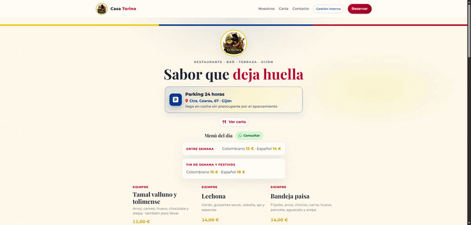
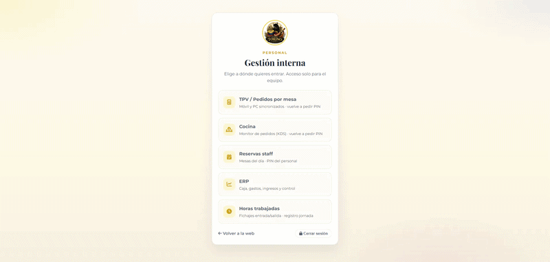

# Web · TPV · Cocina — Casa Torino

Módulo de **sala y escaparate** del monorepo [CasaTorinoApp](https://github.com/Sebastian-Tamayo/CasaTorinoApp).

Un solo deploy en Vercel (`casa-torino-web`) concentra:

| Superficie | Ruta | Quién la usa |
|------------|------|--------------|
| **Web pública** | [`/`](https://casa-torino-web.vercel.app/) | Clientes — carta, menú, contacto |
| **Gestión interna** | [`/interno.html`](https://casa-torino-web.vercel.app/interno.html) | Personal (PIN) — puerta al resto |
| **TPV** | [`/tpv.html`](https://casa-torino-web.vercel.app/tpv.html) | Caja / mesas / cobros |
| **Cocina (KDS)** | [`/cocina.html`](https://casa-torino-web.vercel.app/cocina.html) | Cocina en tiempo real |

[](https://casa-torino-web.vercel.app)
[](#stack)

---


---

## Demostración en Vivo

### TPV

<video src="../docs/media/Tpv/TPV%20Fisico.MP4" controls width="720" playsinline></video>

<video src="../docs/media/Tpv/tpv%20camarera.mov" controls width="720" playsinline></video>




- [TPV físico](../docs/media/Tpv/TPV%20Fisico.MP4) · [TPV camarera](../docs/media/Tpv/tpv%20camarera.mov)

### Cocina (KDS)

<video src="../docs/media/KDS/cocina.mov" controls width="720" playsinline></video>



- [Cocina KDS](../docs/media/KDS/cocina.mov)


## Por qué existe

Casa Torino necesita **una sola URL** para:

1. Mostrar la carta (tema claro, móvil).
2. Cobrar en barra/mesa con sincronización entre dispositivos.
3. Mandar platos a cocina y marcar tiempos (menú español en 2 pases).
4. Cerrar la **jornada de caja** y enviar totales al ERP.

Sin apps nativas: el personal usa el navegador en tablet, PC de caja o móvil.

---

## Capacidades destacadas

### Web pública
- Tema claro/crema (`#fff8e8`)
- Carta y menú del día alineados con precios del TPV
- UX móvil sin scroll interno que bloquee el dedo

### TPV
- Mesas, cuenta, notas, cobro con cajón (QZ Tray / POS-58)
- **Ticket** (imprime) vs **Cobrar** (registra jornada + limpia mesa)
- Categorías: comida, bebidas, cafés, postres, **Varios** (precio libre)
- Precio editable en cuenta para menús y productos libres
- Sync multi-dispositivo + **Total de jornada** (corrección de tickets)
- PIN obligatorio al entrar

### Cocina (KDS)
- Pedidos en vivo desde el TPV
- Menú español: Listo 1º → recogida → Listo 2º
- Histórico del día (purge ~09:00 Europe/Madrid)

### Jornada de caja
- Inicio / total / fin de sesión
- Totales por tipo, categoría y producto
- Corrección de tickets al final del día

---

## Precios menú del día (referencia)

| | Español | Colombiano |
|--|---------|------------|
| Entre semana | 14 € | 13 € |
| Fin de semana | 18 € | 15 € |

Ejemplo: **Pincho 2 €** · **Bocata 3 €** · **Agua 1/2 1,20 €** · **Agua 1L 1,70 €** · refrescos 2,50 € · Chupito 2,50 € · Copa Albariño 3,60 €  

Fuente viva: Supabase `ops_kv` clave `carta` (`GET /api/carta`); fallback `data/carta.json` (TPV + web pública).

---

## Stack

| Capa | Tecnología |
|------|------------|
| UI | HTML + CSS + JS (sin framework en sala — carga rápida) |
| API | Vercel Serverless (`api/carta`, `api/tpv-*`, `api/kitchen`, …) |
| Estado operativo | Supabase `ops_kv` (sync mesas, jornada, cocina, **carta**) |
| Impresión | QZ Tray → POS-58 |
| Hosting | Vercel proyecto `casa-torino-web` (Root Directory = `web`) |

---

## Estructura

```text
web/
├── index.html          # Web pública
├── interno.html        # Hub personal (PIN)
├── tpv.html            # TPV
├── cocina.html         # KDS
├── data/carta.json     # Semilla / fallback de carta
├── carta.js · carta-public.js  # Carga carta (API → JSON)
├── tpv-data.js         # Arranque TPV desde carta
├── tpvSync.js · tpvJornada.js · kitchenSync.js · printService.js
├── api/                # Serverless
├── assets/             # QZ / estáticos
├── scripts/            # assert tema claro · deploy
└── README.md
```

---

## Local y deploy

```bash
# Desde la raíz del monorepo
cd web
# Revisar tema claro antes de publicar
bash scripts/assert-light-theme.sh
```

Deploy de producción (proyecto Vercel `casa-torino-web`): [`../docs/TECNICO.md`](../docs/TECNICO.md) §4.

Secretos: `web/.env.example` → Vercel / `.env.local` (`TPV_PIN`, credenciales ops, etc.).

---

## Encaje en el monorepo

- Reservas del personal → [`../reservas/`](../reservas/)
- ERP (caja TPV, fiscal, RRHH) → [`../erp/`](../erp/)
- Docs → [`../docs/TECNICO.md`](../docs/TECNICO.md) · [`../docs/COMERCIAL.md`](../docs/COMERCIAL.md)

---

## Autor

Parte del ecosistema **Casa Torino** · uso real en Gijón · [CasaTorinoApp](https://github.com/Sebastian-Tamayo/CasaTorinoApp)
